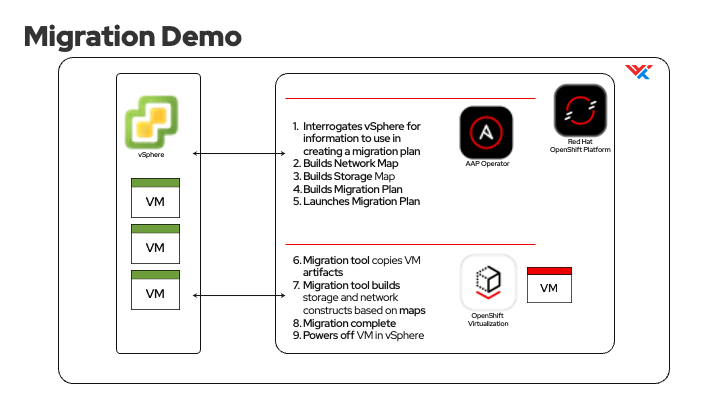
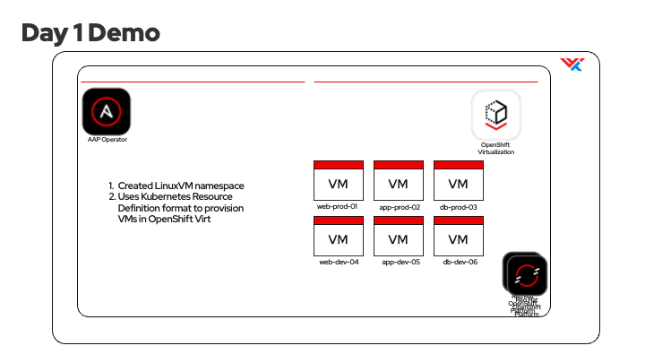
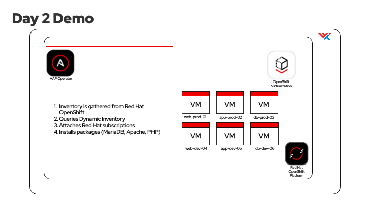

# OpenShift Virtualization Presentation for Red Hat Summit Connect

## Demo #1: Migrated a VM from vSphere to Openshift Virtualization

The migrate playbook calls the create_virt_plan role within the mtv_demo collection. This role creates and runs a migration plan.

## Demo #2: Day 1 Provisioning

Using an ansible playbook to provision new greenfield Linux VMs within OpenShift Virtualization.

## Demo #3: Day 2 Provisiong

Using OpenShift Virtualization as the inventory source, deploy LAMP stack to the newly created Linux VMs.

### additional info

[Red Hat OpenShift Virtualization](https://www.redhat.com/en/technologies/cloud-computing/openshift/virtualization)

[WWT Ansible Learning Labs](https://www.wwt.com/learning-series/infrastructure-automation)
